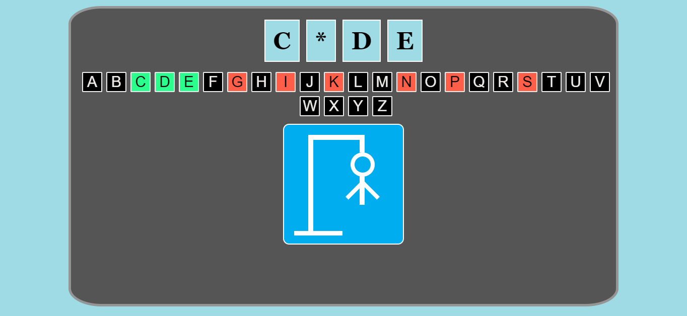
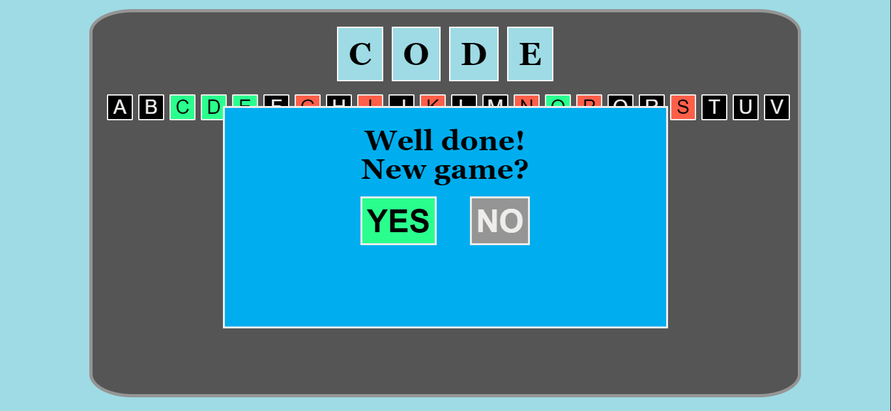
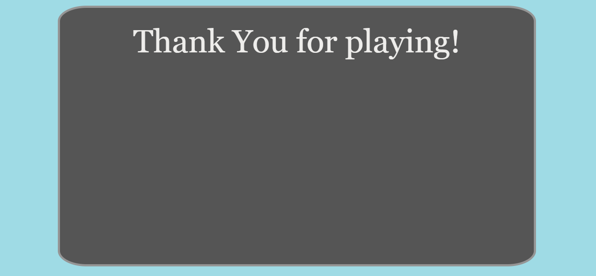

# Hangman

**Hangman** is a guessing Game for one player with Responsive Web Design, created with HTML5, CSS3 & JavaScript using jQuery & Media Queries.  

## About the game:
* The player tries to guess a word by suggesting letters, within a certain number of guesses.
* The word to guess is a noun. Proper nouns, such as names, places, and brands, are not allowed. 
* Each letter of the word is represented by box with a star. 
* If the player suggests a letter which occurs in the word, the letter shows in all its correct positions. Suggesting letter which does not occur in the word draws one element of a hanged man.

## Features:
* Coloring the right letters in green and the wrong - in red;
* You can have 6 error assumptions;
* Drawing with CSS;
* Implemented Responsive Web Design using Media Queries;
* Creating buttons with JavaScript (jQuery);
* Messages for the Player;
* Has favicon;
* Default fonts: 'Georgia', 'Calibri';
* Using HMTL5 semantic tags;
* The game is tested on different resolutions and browsers: Google Chrome 67.0.3396.99; Mozilla Firefox 61.0.1; Opera 54.0.2952.54 and Microsoft Edge 42.17134.1.0.

**Originally developed by:**
* Petya Kostova => [petyakostova](https://github.com/petyakostova)

**The Game is licensed under the GNU General Public License v3.0**

